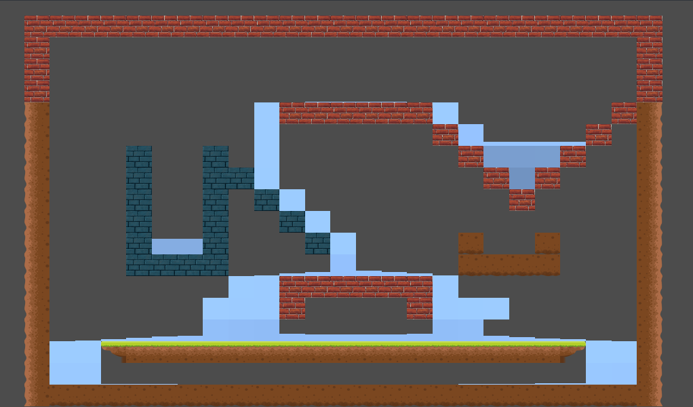

**Hello, welcome to AJ-Wi the space where we learn together**

<div align="right">

# LiquidSim

</div>


## 2D Liquid simulator with cellular automaton in Godot Engine (GDNative / C++) - NativeScript 1.1

## prerequisites

- Godot 3.x executable

- C++ compiler

- SCons as a build tool

- emcc compiler
<hr>

## API

`$LiquidSim.start()` : Start the simulation (started by default)

`$LiquidSim.stop()` : Stop the simulation

`$LiquidSim.update_simulation()` : Force an update

`$LiquidSim.cleanup_empty_cells()` : Cleanup all empty cell (automatic)

`$LiquidSim.add_liquid(int x, int y, float amount)` : Add some liquid to the cell

`$LiquidSim.del_liquid(int x, int y)` : Empty a cell

`$LiquidSim.set_liquid(int x, int y, float amount)` : Set a fixed amount of liquid to the cell

`$LiquidSim.get_liquid(int x, int y) float` : Return the amount of liquid for the cell

<hr>

<br>

<a href="https://aj-wi.github.io/liquid-simulator-godot/game/" target="_blank" rel="noopener">
  
</a>

<br>

### Original repository

```sh
$ git clone --recurse-submodules https://github.com/tterrasson/liquid-simulator-godot
```

## **For more details, see ["Using the Guide"](https://aj-wi.github.io/liquid-simulator-godot/)**

<br>
<hr>

**Remember We can all code, but together we can learn**
