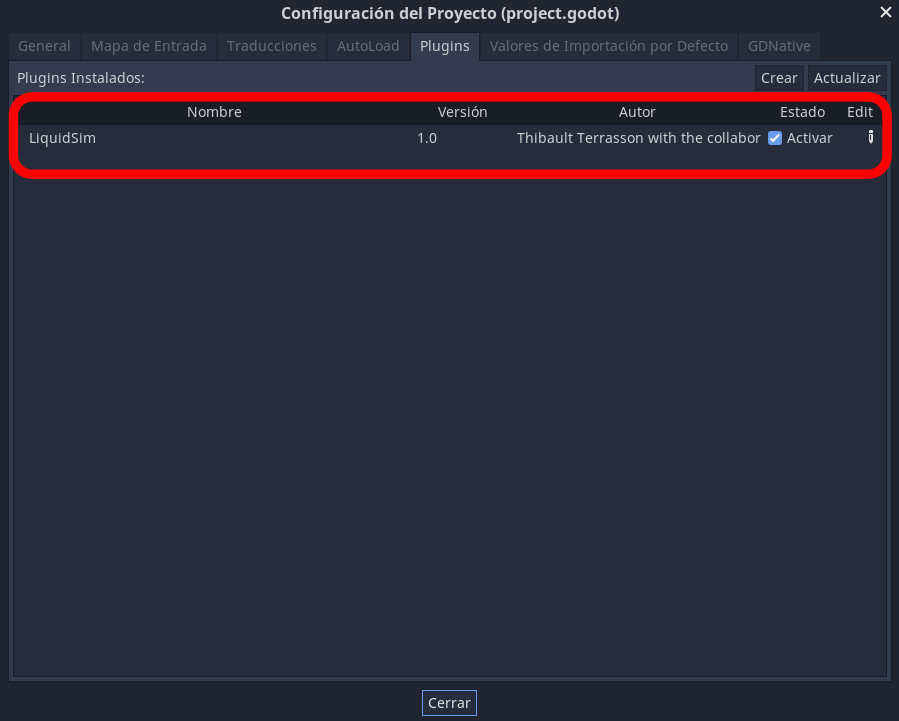
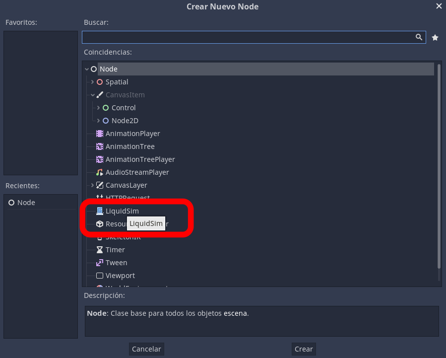
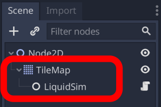
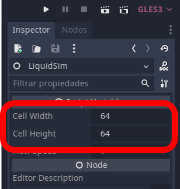

# 2D Liquid simulator with cellular automaton in Godot Engine (GDNative / C++) - NativeScript 1.1


**Demo:** https://www.youtube.com/watch?v=nF7cdUVgvNc

## prerequisites

> Godot 3.x executable
>
> C++ compiler
>
> SCons as a build tool

## clone repository

original repository

```sh
$ git clone --recurse-submodules https://github.com/tterrasson/liquid-simulator-godot
```

this repository

```sh
$ git clone --recurse-submodules https://github.com/AJ-Wi/liquid-simulator-godot
```

## Build godot-cpp binding

```sh
$ cd liquid-simulator-godot/godot-cpp
$ scons platform=<os> generate_bindings=yes
```

## Build plugin

```sh
$ cd ..
$ scons platform=<os>
```

_Replace `<os>` with linux, osx, windows or android._

## Copy the plugin to your project

```sh
$ cp -r bin/* /path/to/yourproject/addons/liquidsim
```

**You must use the same folder name 'liquidsim'**

## Usage

### Activate the `liquidsim` plugin in your project



### Add the `liquidsim` node as a child of your tilemap





### Adjust the size of the cells according to what you put in your tilemap



### Attach a gdscript to the TileMap to test the plugin

Example:

```py
extends TileMap

func _ready():
	pass # Replace with function body.

func _input(event):
	if event is InputEventMouseButton:
        # Mouse in viewport coordinates
		var wpos = world_to_map(get_global_mouse_position())
		$LiquidSim.add_liquid(wpos.x, wpos.y, 10.0)
```

For more details, see ["Using the GDNative module"](https://docs.godotengine.org/en/3.2/tutorials/plugins/gdnative/gdnative-cpp-example.html#using-the-gdnative-module)

## API

`$LiquidSim.start()` : Start the simulation (started by default)

`$LiquidSim.stop()` : Stop the simulation

`$LiquidSim.update_simulation()` : Force an update

`$LiquidSim.cleanup_empty_cells()` : Cleanup all empty cell (automatic)

`$LiquidSim.add_liquid(int x, int y, float amount)` : Add some liquid to the cell

`$LiquidSim.del_liquid(int x, int y)` : Empty a cell

`$LiquidSim.set_liquid(int x, int y, float amount)` : Set a fixed amount of liquid to the cell

`$LiquidSim.get_liquid(int x, int y) float` : Return the amount of liquid for the cell
